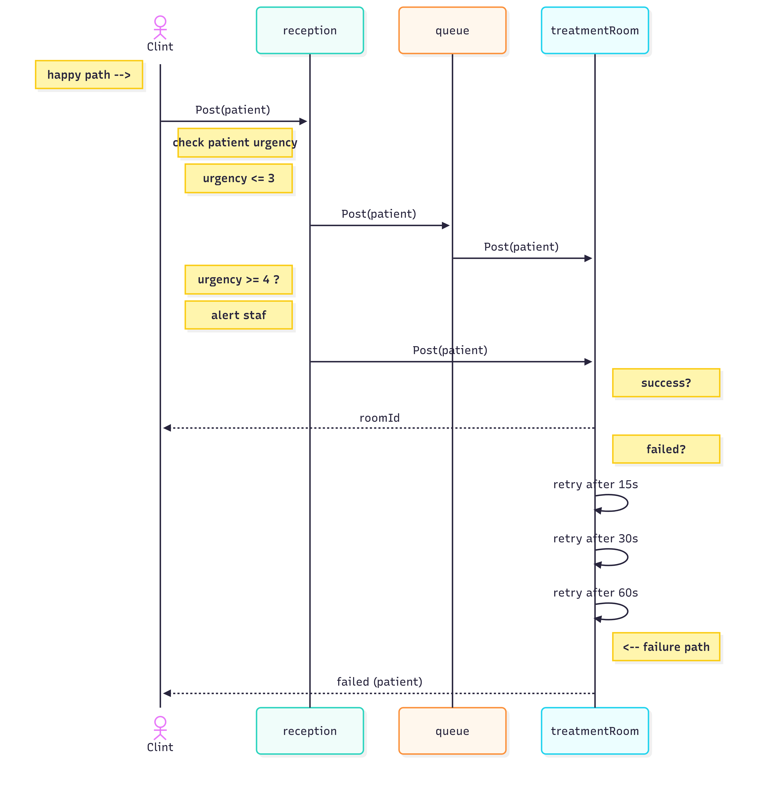

# Emergency room

## The goal is to manage a Emergency room efficiently and effectively.  we are not taking care of the user detals and editem them.

# HLD :
## 🖼️ System Diagram

<!-- ###### This is a Heading h6 -->

## API's

| Method | Endpoint      | Body                    | Response                |
| ------------- |:-------------:| -- | -- | 
|POST |/adimidPatient  |  {patient :Patient} | {patientAssignment : PatientAssignment}     |
| POST| /dischargPatient   | {patientID : string}   | {massege : boolean}     |
|GET |/getRoomStatus  |    | {freeRooms : number , occupiedRooms : number }    |
|GET |/getQueeStatus   |   | {high : number , medium : number , low : number }  |

## error model
| Method| Req | Body   | Res|
| ------------- |:-------------:| ----| ----|
|POST | /adimidPatient |   {patient :string} | {code : 400 ,massge : error}     |
| POST | /dischargPatient |    {patientID : number}   | {code : 400 , massge : error}     |

## schema of treatmentRoom
| roomId  | isAvailable |currentpatient |
| ------------- |:-------------:|:-------------:|
| string|   boolean  | patient| 
## schema of patient
| patientID  | name |age | symptoms | arrivalTime | urgency |
| ------------- |:-------------:|:-------------:| :-------------:|:-------------:| :-------------:|
| string|   string  | number| SymptomsCode[] |Date | Urgency

**indexes:**  
* patientID 
* roomId

**For security purposes, all vehicle details are encrypted,**  

__And every call from the client should have a JWT cookie.__

__There is a limit on the number of API call's from each IP address to a maximum of 10 every 60 seconds.__

__The reason I used MongoDB is mainly because of the flexibility .__

## Tests
|   | | TestType|
| ------------- |:-------------:|:-------------:|
|POST /adimidPatient    {patient :Patient} | {patientAssignment : PatientAssignment}      | success
| POST /dischargPatient    {patientID : string}   | {massege : boolean}     | success 
| POST /dischargPatient     {patientID : number}   | {code : 400 , massge : error}     | error